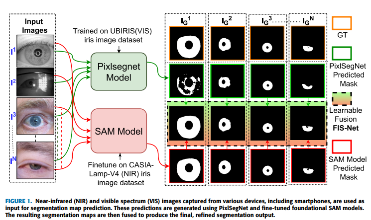
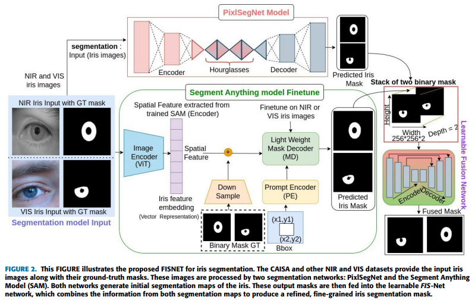
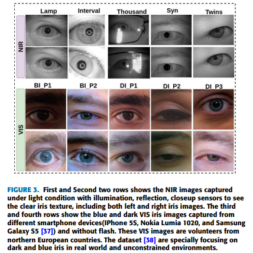
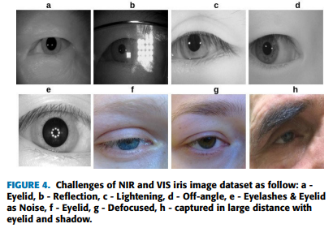
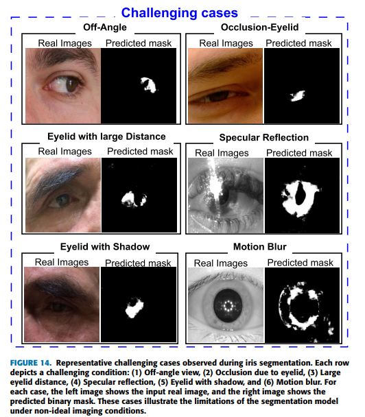

# FISNet: A Learnable Fusion-based Iris Segmentation Network Improving Robustness Across NIR and VIS Modalities

Geetanjali Sharma<sup>1</sup>, Gaurav Jaswal<sup>2</sup>, Aditya Nigam<sup>1</sup>, Raghavendra Ramachandra<sup>3</sup>  
<sup>1</sup> Indian Institute of Technology Mandi, India
<sup>2</sup>Division of Digital Forensics, Directorate of Forensic Services, Shimla, Himachal Pradesh 171002, India
<sup>3</sup>Norwegian University of Science and Technology (NTNU), Gjøvik, Norway

<p align="center">
  <a href="https://example.com"></a>
  <a href="#"></a>
  <a href="#"></a>
</p>

**Abstract:** Iris is one of the most distinctive biometric traits used for reliable identity verification in applications such as border control, secure access systems, and national ID programs. The primary challenge in iris recognition is the reliable segmentation of the iris region from the eye image. Segmenting irises captured under different imaging conditions is challenging for a single model due to variations in spectral features, texture, lighting conditions, and noise patterns between NIR and VIS images. To tackle this problem, we present Fused Iris Segmentation Network (FISNET) that combines segmentation maps from two models to achieve enhanced precision and accuracy. FISNET demonstrates robust generalizability across varying lighting, resolution, and sensor types, consistently outperforming individual models on all NIR and VIS datasets, including smartphone-captured images. The performance of FISNET was evaluated on CASIA-V4 subsets, Dark and Blue iris datasets, and the AFHIRIS dataset, achieving superior segmentation accuracy and recognition performance. The results demonstrate significant improvements over the IrisParseNet,PixlSegNet, and SAM model, achieving remarkable mIoU scores of $0.955$, $0.930$, $0.945$, $0.955$, $0.907$, $0.815$, $0.924$, $0.913$, $0.842$, $0.852$, $0.829$, and $0.839$ on the Lamp-V4, Interval-V4, Thousand-V4, Syn-V4, Twins-V4, UBIRIS-V2, BI-P1, BI-P2, DI-P1, DI-P2, DI-P3, and AFHIRIS-V1 datasets, respectively. Additionally, the Type-I error rate (E1) achieved exceptional results, with values of $0.0014$, $0.0067$, $0.0016$, $0.0012$, $0.0027$, $0.0023$, $0.0015$, $0.0019$, $0.0014$, $0.0015$, $0.0020$, and $0.0069$ across these datasets, further emphasizing the superiority of the proposed approach.
<p align="center">
  
</p>

## FISNET Architecture 
<p align="center">
  
</p>
Figure : Illustrates the proposed FISNET for iris segmentation. The CAISA and other NIR and VIS datasets provide the input iris
images along with their ground-truth masks. These images are processed by two segmentation networks: PixlSegNet and the Segment Anything
Model (SAM). Both networks generate initial segmentation maps of the iris. These output masks are then fed into the learnable FIS-Net
network, which combines the information from both segmentation maps to produce a refined, fine-grained iris segmentation mask.


## Dataset
<p align="center">
  
</p>
Figure : First and Second two rows shows the NIR images captured
under light condition with illumination, reflection, closeup sensors to see
the clear iris texture, including both left and right iris images. The third
and fourth rows show the blue and dark VIS iris images captured from
different smartphone devices(IPhone 5S, Nokia Lumia 1020, and Samsung
Galaxy S5 [37]) and without flash. These VIS images are volunteers from
northern European countries. The dataset [38] are specially focusing on
dark and blue iris in real world and unconstrained environments.

## Challenge Dataset
<p align="center">
  
</p>
Figure : Challenges of NIR and VIS iris image dataset as follow: a -
Eyelid, b - Reflection, c - Lightening, d - Off-angle, e - Eyelashes & Eyelid
as Noise, f - Eyelid, g - Defocused, h - captured in large distance with
eyelid and shadow.

## Challenge segmentation cases
<p align="center">
  
</p>
Figure: Representative challenging cases observed during iris segmentation. Each row
depicts a challenging condition: (1) Off-angle view, (2) Occlusion due to eyelid, (3) Large
eyelid distance, (4) Specular reflection, (5) Eyelid with shadow, and (6) Motion blur. For
each case, the left image shows the input real image, and the right image shows the
predicted binary mask. These cases illustrate the limitations of the segmentation model
under non-ideal imaging conditions.

## Precision and Recall Vs. IoU threshold
<p align="center">
  
</p>

## Results
<p align="center">
  
</p>
Figure: Visual comparison of iris segmentation results across multiple models. The first row displays the original iris images, the second row shows the corresponding ground truth masks, and rows three to seven illustrate the predicted masks from five different segmentation models. Last Overlays column shows GT mask in green, predicted mask in red, and overlapping area i.e both masks agree in yellow color.


## Citation

If you find this work useful, please cite our paper:

```bibtex
@article{sharma2025vreyesam,
  title={VREyeSAM: Virtual Reality Non-Frontal Iris Segmentation using Foundational Model with Uncertainty Weighted Loss},
  author={Sharma Geetanjali, Nagaich Dev, Jaswal Gaurav, Nigam Aditya, and Ramachandra Raghavendra},
  Conference={IJCB},
  year={2025}
}


code : Coming soon !
IrisParseNet code - https://github.com/xiamenwcy/IrisParseNet?tab=readme-ov-file
IrisParseNet Docker -  https://www.codewithgpu.com/i/xiamenwcy/IrisParseNet/casia_caffe_tifs
